# FlexFi - Crypto-Backed BNPL Protocol

> **The freedom to pay with crypto, later.**

FlexFi is a revolutionary Solana-based protocol that enables Buy Now, Pay Later (BNPL) transactions backed by cryptocurrency collateral. Unlike traditional BNPL services, FlexFi eliminates debt traps by requiring users to stake crypto assets as collateral.

## 🌟 Key Features

### 💰 Collateral-Backed BNPL
- **No toxic debt** - Every payment is collateral-backed
- **Automatic liquidation** - No late fees, just collateral forfeit
- **Flexible payment terms** - 3, 4, 6, 12, 18, 24, or 36 installments

### 🎯 Dynamic Credit Scoring
- **Inclusive scoring** - Your access grows as you use the platform
- **Real-time updates** - Score adjusts with payment behavior
- **No bank dependency** - Fully sovereign credit system

### 💎 Multi-Tier Card System
- **Standard** (Free): 7% fees, 3-6 month terms
- **Silver** ($50/year): 4% fees, up to 12 months
- **Gold** ($150/year): 3.5% fees, 0.5% cashback
- **Platinum** ($300/year): 3% fees, 1.5% cashback

### 🎨 NFT Enhancement System
- **Bronze/Silver/Gold NFTs** enhance card benefits
- **Reduced fees** and **increased limits**
- **Unique utility** beyond just aesthetics

### 📈 FlexYield Integration
- **Earn on every purchase** - Rewards invested automatically
- **Multiple strategies** - Staking, DeFi, RWA, Auto-compound
- **Passive income** while spending

## 🏗️ Architecture Overview

### FlexFi Protocol Modules

| 🧩 Module | 🎯 Purpose | 🔧 Key Functions | 💰 Financial Impact |
|-----------|-----------|----------------|-------------------|
| **🔐 Staking** | Collateral Management | • Deposit USDC<br>• Lock periods (7-365 days)<br>• Auto-liquidation | Secures BNPL transactions |
| **🛒 BNPL** | Buy Now Pay Later | • Create payment plans<br>• Process installments<br>• Handle defaults | Core revenue generation |
| **📊 Score** | Credit Assessment | • Track payment history<br>• Dynamic scoring (0-1000)<br>• Risk evaluation | Determines user limits |
| **💳 Card** | User Tiers | • 4 tier system<br>• Annual fee management<br>• Benefit allocation | Subscription revenue |
| **🎨 NFT** | Enhanced Benefits | • Mint utility NFTs<br>• Attach to cards<br>• Dynamic perks | Premium user engagement |
| **📈 Yield** | Reward System | • Auto-invest rewards<br>• Multiple strategies<br>• Compound returns | User retention incentive |

### Data Flow Architecture

```
👤 User → 🔐 Whitelist Check → 💰 Stake Collateral → 🛒 BNPL Eligible
                ↓
📊 Score Tracking ← 💳 Card Benefits ← 🎨 NFT Enhancements ← 📈 Yield Generation
```

### Security & Access Control

| Layer | Component | Access Level | Purpose |
|-------|-----------|--------------|---------|
| **Layer 1** | Whitelist System | Admin-controlled | Platform access |
| **Layer 2** | Wallet Verification | User signature | Transaction auth |
| **Layer 3** | Collateral Check | Protocol logic | Risk management |
| **Layer 4** | Score Validation | Dynamic scoring | Credit limits |

## 🚀 Quick Start

### Prerequisites

- Rust (latest stable)
- Solana CLI tools
- Node.js (for tests)
- Git

### Installation

```bash
# Clone the repository
git clone https://github.com/your-org/flexfi-web3.git
cd flexfi-web3

# Build the program
cargo build-bpf

# Run tests
npm run test
```

### Deployment

```bash
# Deploy to devnet
solana program deploy target/deploy/flexfi_program.so

# Verify deployment
solana program show <PROGRAM_ID>
```

## 📖 Documentation

### Core Modules

#### 🔐 Whitelist System
All users must be whitelisted to use FlexFi functions:

```rust
// Initialize whitelist (admin only)
InitializeWhitelist

// Add user to whitelist
AddToWhitelist { user_pubkey }
```

#### 💰 Staking Module
Users stake USDC as collateral for BNPL transactions:

```rust
// Deposit staking
DepositStaking { amount, lock_days }

// Withdraw staking (after lock period)
WithdrawStaking { amount }
```

#### 🛒 BNPL Module
Create and manage Buy Now, Pay Later contracts:

```rust
// Create BNPL contract
CreateBNPLContract { 
    amount, 
    installments, 
    payment_interval_days 
}

// Make payment
MakeBNPLPayment

// Check for overdue payments
CheckRepayment
```

#### 📊 Score Module
Track and manage user credit scores:

```rust
// Initialize score (500 points default)
InitializeScore

// Update score (automatic)
UpdateScore { change }

// Get current score
GetScore
```

## 🧪 Testing

### Test Structure

```
tests/
├── 1-verify-wallet-whitelisted.js  # Verify wallet whitelist status
├── 2-test-staking-with-backend.js  # Test staking functionality
└── 3-test-score.js                 # Test credit score system
```

### Running Tests

```bash
# Install dependencies
npm install

# Run individual tests
node tests/1-verify-wallet-whitelisted.js
node tests/2-test-staking-with-backend.js
node tests/3-test-score.js
```

## 🎯 User Journeys & Scenarios

### 🆕 Scenario 1: New User Onboarding

#### The Journey: From Registration to First BNPL

```mermaid
flowchart TD
    A[👤 User visits FlexFi] --> B[📝 Register with Email]
    B --> C[🔑 Backend creates wallet]
    C --> D[✅ Admin adds to whitelist]
    D --> E[💰 User stakes 100 USDC]
    E --> F[📊 Score initialized: 500 pts]
    F --> G[💳 Choose card tier]
    G --> H[🛍️ Ready for BNPL!]
    
    style A fill:#e1f5fe
    style H fill:#c8e6c9
```



#### Step-by-Step Breakdown:

| Step | Action | Who | Result |
|------|--------|-----|---------|
| 1 | User registers | User | Account created |
| 2 | Wallet generation | Backend | New Solana wallet |
| 3 | Whitelist addition | Admin | Access granted |
| 4 | Stake collateral | User | 100 USDC locked 30 days |
| 5 | Score initialization | System | 50 credit points |
| 6 | Card selection | User | Silver card active |
| 7 | BNPL eligibility | System | Up to 100 USDC available |

---

### 🛒 Scenario 2: BNPL Purchase Journey

#### The Journey: Buy Now, Pay Later in Action
#### Payment Flow Details:

```
💰 Purchase: $30 sneakers
📊 Split: 3 payments of $10.33 each
🏦 Collateral: 100 USDC staked
💳 Card: Silver (4% fee = $1.20)

Timeline:
Week 1:  ✅ Merchant gets $30 instantly
Week 4:  ✅ Payment 1 ($10.33) - Score: 505
Week 9:  ❌ Payment 2 missed - Auto-debit from staking - Score: 485  
Week 12: ✅ Payment 3 ($10.33) - Contract complete - Score: 505
```

---

### 📈 Scenario 3: FlexYield in Action

#### The Journey: Earning While Spending
#### FlexYield Mathematics:

```
🔹 Purchase: $100 coffee machine
🔹 Gold Card: 0.5% cashback = $0.50
🔹 Strategy: AutoCompound Staking
🔹 APY: ~8% annually

Monthly progression:
Month 1: $0.50 → Stake
Month 2: $1.03 → Compound  
Month 3: $1.59 → Compound
Month 6: $3.24 → Available to claim
```

---

### 🎴 NFT Enhancement Scenario

#### The Journey: Upgrading with NFTs
#### Before vs After NFT:

| Feature | Silver Card | Silver + Bronze NFT |
|---------|-------------|-------------------|
| BNPL Fee | 4% | 3.5% |
| Credit Limit | Standard | +10% |
| Perks | Basic | Priority processing |
| Visual | Standard design | Custom NFT art |

## 🔧 Configuration

### Environment Variables

```env
SOLANA_RPC_URL=https://api.devnet.solana.com
FLEXFI_PROGRAM_ID=7Yd4fxojkMc9ZvCiewx7coorSnFm84VccBiNxX3hujUH
```

### Constants Configuration

Key constants can be modified in `src/constants.rs`:

```rust
// Minimum staking amount (10 USDC)
pub const MIN_STAKING_AMOUNT: u64 = 10_000_000;

// Initial credit score
pub const INITIAL_SCORE: u16 = 50;

// Grace period for late payments
pub const GRACE_PERIOD_DAYS: u8 = 15;
```

## 🛣️ Roadmap

### Phase 1: Core Protocol ✅
- [x] Staking mechanism
- [x] BNPL contracts
- [x] Credit scoring
- [x] Whitelist system

### Phase 2: Enhanced Features 🔄
- [x] Card system implementation
- [x] NFT utility integration
- [x] FlexYield mechanism
- [ ] Cross-chain bridges

### Phase 3: Advanced Features 🔜
- [ ] FlexBoost merchant integration
- [ ] Mobile SDK
- [ ] DeFi integrations
- [ ] Governance token

## 🔒 Security

### Audits
- [ ] Code audit by Certik
- [ ] Economic audit by Gauntlet
- [ ] Bug bounty program

### Best Practices
- All functions require appropriate signatures
- Critical operations include checks and balances
- Automatic liquidation prevents bad debt
- Comprehensive testing coverage

## 🤝 Contributing

We welcome contributions! Please see our [Contributing Guide](CONTRIBUTING.md) for details.

### Development Flow

1. Fork the repository
2. Create a feature branch
3. Write tests for new functionality
4. Ensure all tests pass
5. Submit a pull request

## 📄 License

This project is licensed under the MIT License - see the [LICENSE](LICENSE) file for details.

## 🔗 Links

- **Website**: [flex-fi.io](https://flex-fi.io)
- **Documentation**: [docs.flex-fi.io](https://docs.flex-fi.io)
- **Twitter**: [@FlexFi_](https://twitter.com/FlexFi_)
- **Discord**: [FlexFi Community](https://discord.gg/flexfi)

## 🏆 Key Achievements

- ✅ **Successful Staking**: 100 USDC staked ✓
- ✅ **Score System**: 500 initial points ✓
- ✅ **Whitelist Integration**: Secure access control ✓
- ✅ **Automated Testing**: Comprehensive test suite ✓

---

**Built with ❤️ on Solana**

*FlexFi: Redefining the future of payments with crypto-backed credit.*
